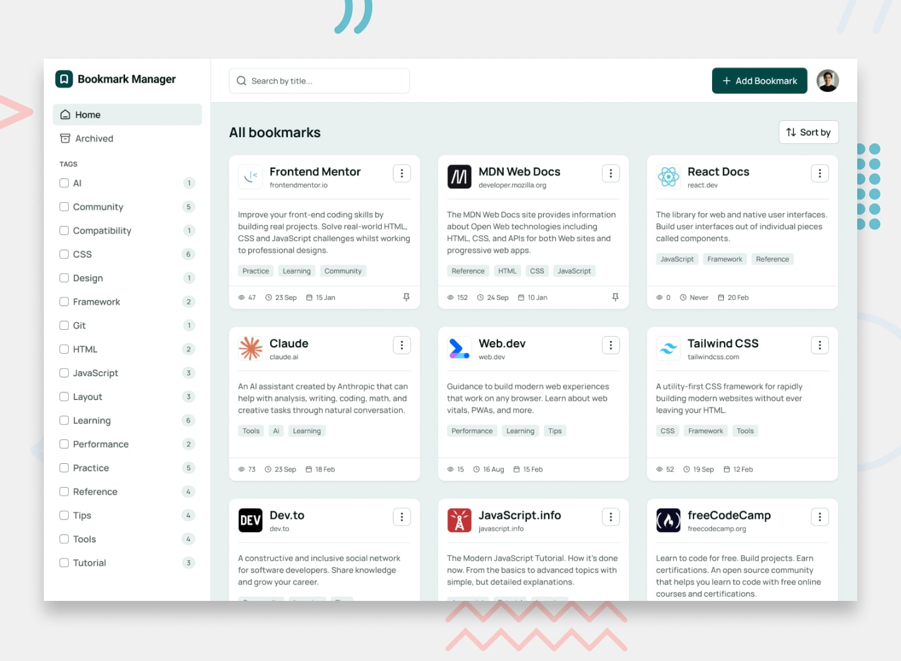

# Frontend Mentor Project: BOOKMARK MANAGER APP

## 📋 Project Overview

- **Challenge:** [Bookmark Manager App](https://www.frontendmentor.io/challenges/bookmark-manager-app)
- **Difficulty:** Advanced
- **Architecture:** Full-stack Next.js Application
- **Start Date:** 13th October, 2025
- **Target Completion:** 30th November, 2025

### Preview Image

## [](./preview.jpg)

## 🎯 Phase 1: Analysis & Planning

### Requirements Checklist

- [x] Read README completely
- [x] Note all functional requirements
- [x] Identify interactive elements needed
- [x] Check for API/data requirements
- [x] Review accessibility requirements
- [x] Note browser support needed

### Core Features Required

**User Management:**

- [ ] User authentication (register/login/logout/forgot password/reset password)
- [ ] User sessions with NextAuth.js
- [ ] Protected routes/pages

**Bookmark Management:**

- [ ] Add new bookmarks (title, description, URL, tags)
- [ ] View all bookmarks with metadata
- [ ] Edit existing bookmarks
- [ ] Archive bookmarks (soft delete)
- [ ] Delete bookmarks (permanent)
- [ ] Pin/unpin bookmarks
- [ ] Copy bookmark URLs to clipboard
- [ ] Visit bookmarked websites directly
- [ ] Track view count and last visited date

**Filtering & Search:**

- [ ] Search bookmarks by title
- [ ] Filter by single or multiple tags
- [ ] Reset tag filters
- [ ] Sort by: Recently added, Recently visited, Most visited
- [ ] View archived bookmarks separately

**UI/UX:**

- [ ] Light/dark theme toggle
- [ ] Responsive design (mobile 375px, desktop 1440px)
- [ ] Hover and focus states
- [ ] Optimal layout for all screen sizes

### Features I want to add later:

- [ ] Automatic favicon fetching
- [ ] Metadata extraction from URLs
- [ ] Browser extension
- [ ] Duplicate detection
- [ ] PWA capabilities
- [ ] Export/import bookmarks
- [ ] Keyboard shortcuts
- [ ] Bookmark collections/folders
- [ ] Social sharing

### Design Analysis

- [x] Review mobile design (375px)
- [x] Review tablet design (768px)
- [x] Review desktop design (1440px)
- [x] Identify breakpoints needed
- [x] Document hover/active states
- [x] Note animations/transitions (None in Figma - will use standard durations) ✅
- [x] List all unique components
- [x] Review authentication design screens (optional)

### Design Tokens Extraction

**Colors:**

```
Light Theme:
  - neutral-900: #051513
  - neutral-800: #4C5C59
  - neutral-500: #899492
  - neutral-400: #C0CFCC
  - neutral-300: #DDE9E7
  - neutral-100: #E8F0EF
  - neutral-0: #FFFFFF

Dark Theme:
  - neutral-900: #001414
  - neutral-800: #001A19
  - neutral-600: #002423
  - neutral-500: #003332
  - neutral-400: #004746
  - neutral-300: #00706E
  - neutral-100: #B1B9B9
  - neutral-0: #FFFFFF

Primary Theme
- teal-800: #013C3B
- teal-700: #014745

Status Colors:
  - red-800: #CB0A04
  - red-600: #FD4740
```

**Typography:**

```
Font Family: Manrope
Weights: 500, 600, 700

Font Sizing:
  text-preset-1 (Page titles, Modal Titles):
    - font-size: 24px
    - line-height: 140%
    - letter-spacing: 0px
    - font-weight: 700 (bold)
  text-preset-2 (Card Titles):
    - font-size: 20px
    - line-height: 120%
    - letter-spacing: 0px
    - font-weight: 700 (bold)
  text-preset-2 (semibold):
    - font-size: 20px
    - line-height: 120%
    - letter-spacing: 0px
    - font-weight: 600 (semibold)
  text-preset-3 (Button, Sidebar Tags):
    - font-size: 16px
    - line-height: 140%
    - letter-spacing: 0px
    - font-weight: 600 (semibold)
  text-preset-3 (medium):
    - font-size: 16px
    - line-height: 130%
    - letter-spacing: 0px
    - font-weight: 500 (medium)
  text-preset-4 (Labels, Dropdown Text):
    - font-size: 14px
    - line-height: 140%
    - letter-spacing: 0px
    - font-weight: 600 (semibold)
  text-preset-4 (medium) (Paragraph, Placeholder, Input Text, Dropdown Email, Toast):
    - font-size: 14px
    - line-height: 140%
    - letter-spacing: 0px
    - font-weight: 500 (medium)
  text-preset-5 (Tags):
    - font-size: 12px
    - line-height: 140%
    - letter-spacing: 0px
    - font-weight: 500 (medium)
```

**Spacing Scale:**

```
- spacing-0: 0px
- spacing-025: 2px
- spacing-050: 4px
- spacing-075: 6px
- spacing-100: 8px
- spacing-125: 10px
- spacing-150: 12px
- spacing-200: 16px
- spacing-250: 20px
- spacing-300: 24px
- spacing-400: 32px
- spacing-500: 40px
- spacing-600: 48px
- spacing-800: 64px
- spacing-1000: 80px
- spacing-1200: 96px
- spacing-1400: 112px
- spacing-1600: 128px
- spacing-1800: 140px
```

### Interactive States & Hover Effects

**Buttons:**
Primary button (teal-700):

- Default: bg-teal-700, text-white
- Hover: bg-teal-800
- Focus (light): ring 4px ring-offset 2px border-teal-700
- Focus (dark): ring 4px ring-offset 2px border-neutral-100

Icon buttons:

- Default: bg-neutral-0
- Hover (light): bg-neutral-100
- Hover (dark): bg-neutral-600
- Focus (light): ring 4px ring-offset 2px border-teal-700
- Focus (dark): ring 4px ring-offset 2px border-neutral-100

**NavLinks:**

- Default: bg-neutral-0
- Hover (light): bg-neutral-100
- Hover (dark): bg-neutral-600
- Selected/Active: bg-neutral-100
- Focus (light): ring 4px ring-offset 2px border-teal-700
- Focus (dark): ring 4px ring-offset 2px border-neutral-100

**Links:**

- Default: text-neutral-900
- Hover: text-neutral-700
- Focus (light): ring 4px ring-offset 2px border-teal-700
- Focus (dark): ring 4px ring-offset 2px border-neutral-100

**Bookmark Cards:**

- Default shadow: 0 2px 4px 0 rgba(21, 21, 21, 0.6)
- Hover:
- Selected:

**Form Inputs:**

- Default: border-neutral-500
- Hover (light): bg-neutral-100
- Hover (dark): bg-neutral-500
- Focus (light): ring 4px ring-offset 2px border-teal-700
- Focus (dark): ring 4px ring-offset 2px border-neutral-100
- Error: border-red-800

**Tags/Filters (in Sidebar):**

- Unselected (light): bg-neutral-0
- Unselected (dark): bg-neutral-800
- Checkbox Hover (light): bg-neutral-300
- Checkbox Hover (dark): bg-neutral-600
- Item hover (light): bg-neutral-100
- Item hover (dark): bg-neutral-600
- Selected/Active: bg-teal-700

**Dropdown Menu:**

- Item hover (light): bg-neutral-100
- Item hover (dark): bg-neutral-600
- Item focus (light): ring 4px ring-offset 2px border-teal-700
- Item Focus (dark): ring 4px ring-offset 2px border-neutral-100

### Animations & Transitions (Standard Implementations)

**Note:** Figma design has no animations specified. Using industry-standard durations.

**Transition Durations (Already defined):**
- Fast: 150ms (hover states, small UI changes)
- Normal: 300ms (modals, dropdowns, page elements)
- Slow: 500ms (page transitions, complex animations)

**Easing:**
- Default: ease-in-out (Tailwind default)
- Modal/Dialog: ease-out (feels snappier)
- Exit animations: ease-in

**What Will Animate:**

**Modal/Dialog:**
- Enter: Fade in + scale from 95% to 100% (300ms)
- Exit: Fade out + scale to 95% (200ms)
- Backdrop: Fade in/out (150ms)

**Toast Notifications:**
- Enter: Slide in from top + fade in (300ms)
- Duration visible: 4 seconds
- Exit: Slide up + fade out (200ms)

**Dropdown Menus:**
- Open: Fade in + slide down slightly (150ms)
- Close: Fade out (100ms)

**Buttons:**
- Hover: Background color change (150ms)
- Active/Press: Scale to 98% (100ms)
- No shadow animations (too heavy)

**Cards (Bookmark):**
- Hover: Shadow elevation change (150ms)
- Actions appear: No animation (always visible or instant show)

**Form Inputs:**
- Focus: Border color change (150ms)
- Error state: Shake animation (400ms) - optional

**Page Transitions:**
- None (instant route changes - Next.js default)
- Loading states: Skeleton screens (no spinner animations)

**Micro-interactions:**
- Checkbox: Check mark draw animation (200ms)
- Toggle switch: Slide + color change (200ms)
- Copy button: Icon swap (checkmark for 2s) (150ms)
- Pin icon: Color change only (150ms)

**What NOT to Animate:**
- Regular text/content (page loads)
- Bookmark card entry (layout shift issues)
- Tag badges (too many, performance)
- Scroll behavior (keep native)

**Other:**
```
Border Radius:
  - radius-0: 0px
  - radius-4: 4px
  - radius-6: 6px
  - radius-8: 8px
  - radius-10: 10px
  - radius-12: 12px
  - radius-16: 16px
  - radius-20: 20px
  - radius-24: 24px
  - radius-full: 9999px

Box Shadows:
  - Inner (button): 0 0 0 1px rgba(34, 38, 39, 0.12)
  - Small (bookmark cards, auth modals): 0 2px 4px 0 rgba(21, 21, 21, 0.6)
  - Medium (toats): 0 6px 9px 0 rgba(21, 21, 21, 0.8)
  - Large (dropdowns): 0 6px 14px 0 rgba(34, 38, 39, 0.10)

Max Width:
  - Content: 1280px
  - Form: 570px

Breakpoints:
  - Mobile: 375px
  - Tablet: 768px
  - Desktop: 1440px
```

### Component Inventory Checklist

**Auth Components:**
- [ ] LoginForm
- [ ] RegisterForm
- [ ] ForgotPasswordForm
- [ ] ResetPasswordForm

**Layout Components:**
- [ ] Header (with search, add button, profile dropdown)
- [ ] Sidebar (logo, nav, tag filters)
- [ ] ProfileDropdown (user info, theme toggle, logout)

**Bookmark Components:**
- [ ] BookmarkCard (with all actions)
- [ ] BookmarkForm (create/edit)
- [ ] BookmarkGrid/List container
- [ ] EmptyState (no bookmarks)

**Filter Components:**
- [ ] SearchBar (with debounce)
- [ ] SortDropdown (3 options)
- [ ] TagFilter (checkboxes with counts)
- [ ] ResetFilters button

**UI Primitives (Custom):**
- [ ] Button (primary, secondary, icon variants)
- [ ] Input (text, email, password, textarea)
- [ ] Modal (for bookmark form)
- [ ] Dialog (for confirmations)
- [ ] Checkbox (custom styled)
- [ ] Dropdown/Select
- [ ] Badge (for tags)
- [ ] Avatar
- [ ] Toast (using Sonner)
- [ ] ThemeToggle

**Micro-components:**
- [ ] Favicon display (with fallback)
- [ ] TagBadge (pill style)
- [ ] BookmarkMeta (dates, view count)
- [ ] LoadingSpinner
- [ ] ErrorMessage
- [ ] SkeletonLoader (for bookmarks)
- [ ] AvatarUpload (Cloudinary integration)

**Settings Components:**
- [ ] SettingsLayout (tabs: Profile, Security, Preferences)
- [ ] ProfileForm (name, email, avatar upload)
- [ ] PasswordChangeForm (current, new, confirm)
- [ ] AccountDangerZone (delete account, export data)

---

## 🗄 Phase 2: Database Architecture

### Database Schema

**User Table:**

```
- id: UUID (Primary Key)
- email: String (Unique, required)
- name: String (required)
- password: String (hashed, required)
- avatar: String? (optional, Cloudinary public_id, URL)
  emailVerified: DateTime? // For email verification
- deletedAt: DateTime? // For soft delete
- createdAt: DateTime
- updatedAt: DateTime

Relationships:
- Has many Bookmarks
- Has many Tags
```

**Bookmark Table:**

```
- id: UUID (Primary Key)
- userId: UUID (Foreign Key → User)
- title: String (required)
- description: String (required)
- url: String (required, unique per user)
- favicon: String? (optional, Cloudinary URL)
- viewCount: Int (default: 0)
- lastVisited: DateTime
- isPinned: Boolean (default: false)
- isArchived: Boolean (default: false)
- archivedAt: DateTime?
- createdAt: DateTime
- updatedAt: DateTime

Relationships:
- Belongs to User
- Has many BookmarkTags (junction)

Indexes:
- userId (for query performance)
- isArchived (for filtering)
```

**Tag Table:**

```
- id: UUID (Primary Key)
- userId: UUID (Foreign Key → User)
- name: String (required)
- createdAt: DateTime

Relationships:
- Belongs to User
- Has many BookmarkTags (junction)

Constraints:
- Unique (userId, name) - prevent duplicate tags per user

Indexes:
- userId
```

**BookmarkTag Table (Junction):**

```
- bookmarkId: UUID (Foreign Key → Bookmark)
- tagId: UUID (Foreign Key → Tag)

Primary Key: (bookmarkId, tagId)

Relationships:
- Many-to-many between Bookmarks and Tags
```

### Relationship Summary

```
User (1) ──────< (Many) Bookmarks
User (1) ──────< (Many) Tags
Bookmark (Many) ←──→ (Many) Tags (via BookmarkTag)
```
---

## 🛠 Phase 3: Technical Stack

### Tech Stack

- [x] **Framework:** Next.js 15+ (App Router)
- [x] **Language:** TypeScript
- [x] **Database:** PostgreSQL
- [x] **ORM:** Prisma
- [x] **Authentication:** NextAuth.js v5
- [x] **Email:** Resend (for password resets)
- [x] **Styling:** Tailwind CSS
- [x] **UI Components:** Custom Components
- [x] **Deployment:** Vercel
- [x] **Icons:** Lucide React
- [x] **Toasts:** Sonner
- [x] **Favicon Fetching:** Google Favicon Service (fetch source)
- [x] **Image Storage:** Cloudinary (avatars & favicons)
- [x] **Version Control:** Git + GitHub

### Additional Libraries

- [x] **Validation:** Zod
- [x] **Password Hashing:** bcryptjs
- [x] **Date Handling:** date-fns
- [x] **Data Fetching:** TanStack Query
- [x] **Form Management:** React Hook Form
- [x] **Image Upload:** next-cloudinary
- [x] **Component Variants:** class-variance-authority (CVA)
- [x] **Class Utilities:** clsx + tailwind-merge
- [x] **Code Formatter:** Prettier + prettier-plugin-tailwindcss
- [x] **Rate Limiting:** @upstash/ratelimit (add for production)
- [x] **Environment Validation:** @t3-oss/env-nextjs (add for production)

### State Management

- [x] **Server State:** TanStack Query
- [x] **Client State:** Zustand
- [x] **Form State:** React Hook Form + Zod
- [x] **Theme State:** next-themes

### Development Tools

- [x] **Linting:** ESLint (included with Next.js)
- [x] **Formatting:** Prettier
- [x] **Type Checking:** TypeScript strict mode
- [x] **Dev Tools:** TanStack Query DevTools
---

## 🏗 Phase 4: API Architecture

### API Endpoints

**Authentication:**

```
POST   /api/auth/register          - Create new user account
POST   /api/auth/[...nextauth]     - Login/logout (NextAuth)
POST   /api/auth/forgot-password   - Send Password reset link
POST   /api/auth/reset-password    - Reset user password
```

**Bookmarks:**

```
GET    /api/bookmarks              - Get all user bookmarks (with filters)
  Query params:
  - search: string (search by title)
  - tags: string[] (filter by tags)
  - sort: 'recently-added' | 'recently-visited' | 'most-visited'
  - archived: boolean (show archived)
  - pinned: boolean (show only pinned)

POST   /api/bookmarks              - Create new bookmark
GET    /api/bookmarks/[id]         - Get single bookmark
PATCH  /api/bookmarks/[id]         - Update bookmark
DELETE /api/bookmarks/[id]         - Delete bookmark
POST   /api/bookmarks/[id]/visit   - Increment view count
```

**Tags:**

```
GET    /api/tags                   - Get all user tags (with counts)
DELETE /api/tags/[id]              - Delete tag
```

**User Settings:**
```
PATCH  /api/user/profile        - Update name, avatar
PATCH  /api/user/email          - Update email
PATCH  /api/user/password       - Change password
DELETE /api/user/account        - Delete account
```

**Optional Advanced:**

```
POST   /api/bookmarks/fetch-metadata  - Fetch URL metadata
GET    /api/bookmarks/export          - Export bookmarks
POST   /api/bookmarks/import          - Import bookmarks
```

### API Response Format

```typescript
Success:
{
  success: true,
  data: T
}

Error:
{
  success: false,
  error: string,
  code?: string
}
```

---

## 📁 Phase 5: Project Structure

### Folder Structure

```
bookmark-manager/
├── app/
│   ├── (auth)/                    # Route group - auth pages
│   │   ├── login/
│   │   │   └── page.tsx
│   │   └── register/
│   │       └── page.tsx
│   │   └── forgot-password/
│   │       └── page.tsx
│   │   └── reset-password/
│   │       └── page.tsx
│   │
│   ├── (dashboard)/               # Route group - protected pages
│   │   ├── page.tsx               # Main bookmarks view
│   │   ├── archived/
│   │   │   └── page.tsx           # Archived bookmarks
│   │   └── settings/
│   │       └── page.tsx           # User profile/preferences
│   │
│   ├── api/
│   │   ├── auth/
│   │   │   ├── [...nextauth]/route.ts
│   │   │   └── register/route.ts
│   │   │   └── forgot-password/route.ts
│   │   │   └── reset-password/route.ts
│   │   ├── bookmarks/
│   │   │   ├── route.ts
│   │   │   └── [id]/
│   │   │       ├── route.ts
│   │   │       └── visit/route.ts
│   │   └── tags/
│   │       ├── route.ts
│   │       └── [id]/route.ts
│   │
│   ├── layout.tsx                 # Root layout
│   └── globals.css
│
├── components/
│   ├── auth/
│   │   ├── LoginForm.tsx
│   │   ├── RegisterForm.tsx
|   |   ├── ForgotPasswordForm.tsx
│   │   └── ResetPasswordForm.tsx
│   ├── bookmarks/
│   │   ├── BookmarkCard.tsx
│   │   ├── BookmarkForm.tsx
│   │   └── BookmarkGrid.tsx
│   ├── layout/
│   │   ├── Header.tsx
│   │   ├── Sidebar.tsx
│   │   └── Footer.tsx
│   ├── ui/
│   │   ├── Button.tsx
│   │   ├── Input.tsx
│   │   ├── Modal.tsx
│   │   ├── Dialog.tsx
│   │   ├── Checkbox.tsx
│   │   ├── Dropdown.tsx
│   │   ├── Badge.tsx
│   │   ├── Avatar.tsx
│   │   ├── Toast.tsx
│   │   └── ThemeToggle.tsx
│   ├── settings/              
│   │   ├── ProfileForm.tsx
│   │   ├── PasswordChangeForm.tsx
│   │   ├── AvatarUpload.tsx
│   │   └── AccountDangerZone.tsx
│   └── filters/
│       ├── SearchBar.tsx
│       ├── SortDropdown.tsx
│       └── TagFilter.tsx
│
├── lib/
│   ├── prisma.ts                  # Prisma client singleton
│   ├── auth.ts                    # NextAuth config
│   ├── types.ts                   # TypeScript types
│   ├── utils.ts                   # Utility functions
│   ├── validations.ts             # Zod schemas
│   ├── cloudinary.ts              # Cloudinary integration
│   ├── toast.ts                   # Toast notifications
│   └── uploads.ts                 # File upload utilities
│
├── hooks/
│   ├── useBookmarks.ts
│   ├── useTags.ts
│   ├── useTheme.ts
│   └── useDebounce.ts
│
├── prisma/
│   ├── schema.prisma
│   ├── seed.ts
│   └── migrations/
│
├── public/
│   └── images/
│
├── .env.local
├── .gitignore
├── next.config.js
├── package.json
├── tailwind.config.ts
├── tsconfig.json
└── README.md
```

### Component Hierarchy

```
App
├── RootLayout
│   ├── ThemeProvider
│   └── SessionProvider
│
├── Auth Pages (Public)
│   ├── LoginPage
│   │   └── LoginForm
│   ├── RegisterPage
│   |   └── RegisterForm
│   ├── ForgotPasswordPage
│   │   └── ForgotPasswordForm
│   └── ResetPasswordPage
│       └── ResetPasswordForm
│
└── Dashboard (Protected)
    ├── Header
    │   ├── SearchBar
    │   ├── Add Bookmark Button
    │   └── Profile Dropdown
    │       ├── User Info
    │       ├── Theme Toggle
    │       ├── User Settings Link
    │       └── Logout Button
    │
    ├── Sidebar
    │   ├── Logo
    │   ├── Navigation Links
    │   ├── Reset Filters Button
    │   └── Tag List
    │        └── TagCheckbox (multiple with counts)
    │
    ├── User Profile/Settings Page
    │   ├── ProfileForm
    │   │   ├── Inputs: Name, Email, AvatarUpload
    │   │   └── Buttons: Save Changes
    │   ├── PasswordChangeForm
    │   │   ├── Inputs: Current, New, Confirm Password
    │   │   └── Buttons: Change Password
    │   └── AccountDangerZone
    │       ├── Buttons: Delete Account, Export Data
    │       └── Confirmation Dialogs
    │
    └── Main Content
        ├── Sort Dropdown
        │   ├── Recently Added
        │   ├── Most Visited
        │   └── Recently Visited
        |
        ├── BookmarkGrid
        │   └── BookmarkCard (multiple)
        │       ├── Favicon
        │       ├── BookmarkInfo (title, URL, description)
        │       ├── TagList
        │       │   └── TagBadge (multiple)
        │       ├── BookmarkMeta (views, dates)
        │       ├── PinIcon (if pinned)
        │       └── BookmarkActions
        │           ├── ArchiveButton (Main Page)
        │           ├── UnarchiveButton (Archive Page)
        │           ├── CopyURLButton (Main & Archive Page)
        │           ├── PinButton (Main Page)
        │           ├── UnpinButton (Main Page if pinned)
        │           ├── EditButton (Main Page)
        │           ├── DeletePermanentButton (Archive Page)
        │           └── VisitButton (Main & Archive Page)
        │
        ├── EmptyState (no bookmarks)
        |
        ├── Pagination or Load More Button (if needed)
        |
        ├── Modals
        |   ├── AddBookmarkModal
        |   │   └── BookmarkForm
        |   |       ├── Inputs: Title, Description, URL, Tags
        |   |       └── Buttons: Add Bookmark, Cancel
        |   └── EditBookmarkModal (Main Page)
        |       └── BookmarkForm (reused)
        ├── Dialogs
        |    ├── DeleteBookmarkDialogs (Archive Page)
        |    |   └── Buttons: Delete permanently, Cancel
        |    ├── ArchiveBookmarkDialogs (Main Page)
        |    |   └── Buttons: Archive, Cancel
        |    └── UnarchiveBookmarkDialogs (Archive Page)
        |        └── Buttons: Unarchive, Cancel
        └── Toast (multiple)
```

---

## 🔐 Phase 6: Security & Validation

### Validation Schemas (Zod)

```typescript
// User validation
registerSchema = {
  name: min(2), max(50)
  email: valid email format
  password: min(8), contains uppercase, lowercase, number, special character
}

// Bookmark validation
bookmarkSchema = {
  title: min(1), max(200)
  description: max(500)
  url: valid URL format
  tags: array of strings, max 10 tags
}

// Tag validation
tagSchema = {
  name: min(1), max(30)
  format: alphanumeric + hyphens/underscores only
}
```

### Authorization Rules

- [ ] All API routes check user session
- [ ] Users can only access their own bookmarks
- [ ] Users can only access their own tags
- [ ] Validate userId matches session.user.id on mutations
- [ ] Implement middleware for route protection

### Security Checklist

- [ ] Password hashing with bcrypt (10+ rounds)
- [ ] CSRF protection (NextAuth handles)
- [ ] Input sanitization for XSS prevention
- [ ] URL validation before external requests
- [ ] Rate limiting on API routes
- [ ] Environment variables for secrets
- [ ] SQL injection prevention (Prisma handles)

---

## 📊 Phase 7: Data Flow & State

### State Management Strategy

**Server State (Database):**

- Bookmarks list with metadata
- Tags with bookmark counts
- User profile data
- _Tool:_ TanStack Query

**Client State (UI):**

- Filter state (selected tags, search query, sort option)
- Modal open/close states
- Theme preference
- Loading/error states
- _Tool:_ Zustand

**Form State:**

- Bookmark form inputs
- Validation errors
- Submission status
- _Tool:_ React Hook Form + Zod

### Key Data Flows

**Adding a Bookmark:**

1. User clicks "Add Bookmark" → Modal opens
2. User fills form, client validates (Zod)
3. POST /api/bookmarks
4. Server validates, creates bookmark + tags
5. Async fetches favicon, updates bookmark
6. Returns new bookmark
7. Cache updates (optimistic UI)
8. Modal closes, success toast

**Filtering by Tags:**

1. User selects tag(s) in sidebar
2. Update selectedTags state
3. Trigger: GET /api/bookmarks?tags=tag1,tag2
4. Re-render BookmarkGrid with filtered results

**Search:**

1. User types in search (debounced 300ms)
2. Update searchQuery state
3. Trigger: GET /api/bookmarks?search=query
4. Results update in real-time

**Incrementing View Count:**

1. User clicks "Visit" on bookmark
2. POST /api/bookmarks/[id]/visit
3. Opens URL in new tab
4. Server increments viewCount, updates lastVisited
5. UI updates optimistically

---

## 🎨 Phase 8: Implementation Plan

### Build Order

**Phase 1: Infrastructure Setup (Days 1-2)**

1. [x] Initialize Next.js project with TypeScript
2. [x] Set up Tailwind CSS
3. [ ] Install all dependencies
4. [ ] Configure TypeScript (strict mode)
5. [ ] Set up folder structure
6. [x] Initialize Git repository

**Phase 2: Database & Auth (Days 3-4)**

1. [ ] Initialize Prisma
2. [ ] Write Prisma schema
3. [ ] Set up database (local or cloud)
4. [ ] Run migrations
5. [ ] Create seed data
6. [ ] Set up Prisma client singleton
7. [ ] Configure NextAuth.js
8. [ ] Create auth API routes
9. [ ] Build auth pages (login, register)
10. [ ] Implement middleware for route protection
11. [ ] Set up Cloudinary account
12. [ ] Create upload presets
13. [ ] Add Cloudinary env variables
14. [ ] Create favicon upload utility

**Phase 3: Core API (Days 5-7)**

1. [ ] Create TypeScript types/interfaces
2. [ ] Write Zod validation schemas
3. [ ] Build bookmark API routes (CRUD)
4. [ ] Build tag API routes
5. [ ] Test API with Prisma Studio
6. [ ] Test API with Postman/Thunder Client

**Phase 4: UI Foundation (Days 8-10)**

1. [ ] Extract design tokens from Figma
2. [ ] Set up Tailwind config with theme
3. [ ] Build layout components (Header, Sidebar)
4. [ ] Build base UI components (Button, Input, Modal)
5. [ ] Implement theme toggle (light/dark)
6. [ ] Build AvatarUpload component (Cloudinary)
7. [ ] Test favicon auto-fetching and upload

**Phase 5: Bookmark Features (Days 11-14)**

1. [ ] Build BookmarkCard component
2. [ ] Build BookmarkGrid component
3. [ ] Build BookmarkForm component
4. [ ] Implement add bookmark functionality
5. [ ] Implement edit bookmark functionality
6. [ ] Implement delete bookmark functionality
7. [ ] Implement pin/unpin functionality
8. [ ] Implement archive functionality
9. [ ] Implement copy URL functionality
10. [ ] Implement visit tracking

**Phase 6: Search & Filtering (Days 15-16)**

1. [ ] Build SearchBar component
2. [ ] Implement search functionality (debounced)
3. [ ] Build TagFilter component
4. [ ] Implement multi-tag filtering
5. [ ] Build SortDropdown component
6. [ ] Implement sorting (3 options)
7. [ ] Create archived bookmarks view

**Phase 7: Polish & Optimization (Days 17-18)**

1. [ ] Add loading states
2. [ ] Add error handling
3. [ ] Implement optimistic UI updates
4. [ ] Add animations/transitions
5. [ ] Optimize images (favicons)
6. [ ] Add toast notifications
7. [ ] Implement keyboard shortcuts (optional)
8. [ ] Test responsive design thoroughly

**Phase 8: Testing & Deployment (Day 19)**

1. [ ] Test all features end-to-end
2. [ ] Cross-browser testing
3. [ ] Mobile testing
4. [ ] Fix bugs
5. [ ] Write deployment documentation
6. [ ] Deploy to Vercel
7. [ ] Test production build

---

## ✅ Phase 9: Quality Assurance

### Pre-Submission Checklist

**Design Accuracy:**

- [ ] Mobile design matches Figma (375px)
- [ ] Desktop design matches Figma (1440px)
- [ ] Tablet breakpoint works smoothly
- [ ] All hover states implemented
- [ ] All focus states implemented
- [ ] Spacing and alignment accurate
- [ ] Typography matches design system
- [ ] Colors match in both themes

**Functionality - Authentication:**

- [ ] User registration works
- [ ] User login works
- [ ] User logout works
- [ ] Protected routes redirect to login
- [ ] Session persists on refresh
- [ ] Password validation works

**Functionality - Bookmarks:**

- [ ] Add bookmark with tags works
- [ ] Edit bookmark works
- [ ] Delete bookmark works
- [ ] Archive/unarchive works
- [ ] Pin/unpin works
- [ ] Copy URL works
- [ ] Visit link opens in new tab
- [ ] View count increments
- [ ] Last visited updates

**Functionality - Search & Filter:**

- [ ] Search by title works
- [ ] Multi-tag filtering works
- [ ] Filter reset works
- [ ] Sort by recently added works
- [ ] Sort by recently visited works
- [ ] Sort by most visited works
- [ ] Archived view shows only archived

**Functionality - UI/UX:**

- [ ] Theme toggle works (persists)
- [ ] All modals open/close correctly
- [ ] Form validation displays errors
- [ ] Loading states show during requests
- [ ] Error states show on failures
- [ ] Success messages appear
- [ ] No console errors
- [ ] Smooth animations/transitions

**Accessibility:**

- [ ] Semantic HTML used throughout
- [ ] All images have alt text
- [ ] All form inputs have labels
- [ ] Keyboard navigation works
- [ ] Focus indicators visible
- [ ] ARIA labels on icon buttons
- [ ] Color contrast meets WCAG AA
- [ ] Screen reader compatible (optional test)

**Code Quality:**

- [ ] TypeScript strict mode (no `any`)
- [ ] All components properly typed
- [ ] API routes have error handling
- [ ] Code is clean and organized
- [ ] No unused imports/variables
- [ ] Consistent naming conventions
- [ ] Comments added where needed
- [ ] Environment variables documented

**Security:**

- [ ] Passwords are hashed
- [ ] Auth routes are protected
- [ ] API validates user ownership
- [ ] No sensitive data exposed
- [ ] Input validation on client & server
- [ ] CSRF protection enabled
- [ ] Rate limiting considered

**Performance:**

- [ ] Images optimized
- [ ] Search is debounced
- [ ] No unnecessary re-renders
- [ ] Database queries optimized
- [ ] Indexes added on userId
- [ ] No performance warnings
- [ ] Page loads quickly

**Database:**

- [ ] Migrations run successfully
- [ ] Seed data works
- [ ] Foreign keys set up correctly
- [ ] Cascade deletes work
- [ ] Unique constraints enforced
- [ ] Indexes improve query speed

**Cross-Browser Testing:**

- [ ] Chrome
- [ ] Firefox
- [ ] Safari
- [ ] Edge
- [ ] Mobile Safari
- [ ] Mobile Chrome

**Responsive Testing:**

- [ ] 375px (mobile)
- [ ] 768px (tablet)
- [ ] 1440px (desktop)
- [ ] Intermediate sizes (480px, 1024px, 1920px)

---

## 📝 Phase 10: Documentation & Deployment

### README Updates

- [ ] Project description
- [ ] Live demo link
- [ ] Screenshots (desktop + mobile)
- [ ] Features list
- [ ] Tech stack
- [ ] Environment variables needed
- [ ] Installation instructions
- [ ] Database setup instructions
- [ ] Seed data instructions
- [ ] Development server commands
- [ ] Build/deployment instructions
- [ ] Challenges faced
- [ ] Lessons learned
- [ ] Future improvements
- [ ] Credits/acknowledgments

### Deployment Checklist

- [ ] Environment variables set on host
- [ ] Database connected
- [ ] Build succeeds
- [ ] Migrations run on production DB
- [ ] Authentication works in production
- [ ] All features tested in production
- [ ] Custom domain configured (optional)
- [ ] SSL certificate active

**Deployment Platform:** Vercel (recommended for Next.js)

- [ ] Live URL: **\_\_\_**
- [ ] Repository URL: **\_\_\_**

---

## 🎓 Reflection

### What went well:

-

### Challenges faced:

-

### What I learned:

- TypeScript integration with Next.js
- Prisma ORM and database design
- NextAuth.js authentication flow
- Full-stack API architecture
- Advanced state management
-

### What I'd do differently next time:

-

### Time spent:

- Planning & Setup: 5h
- Database & Auth: \_\_\_h
- API Development: \_\_\_h
- UI Development: \_\_\_h
- Features Implementation: \_\_\_h
- Testing & Polish: \_\_\_h
- Deployment: \_\_\_h
- **Total:** \_\_\_h

---

## 📌 Notes & Resources

### Useful Links

- [Next.js Documentation](https://nextjs.org/docs)
- [Prisma Documentation](https://www.prisma.io/docs)
- [NextAuth.js v5 Guide](https://authjs.dev/)
- [Tailwind CSS Docs](https://tailwindcss.com/docs)
- [Zod Documentation](https://zod.dev/)
- [TanStack Query Docs](https://tanstack.com/query/latest)

### Code Snippets & Patterns

[Add useful code patterns, helpers, or solutions discovered during development]

### Design Decisions Log

[Document important architectural decisions and their reasoning]
